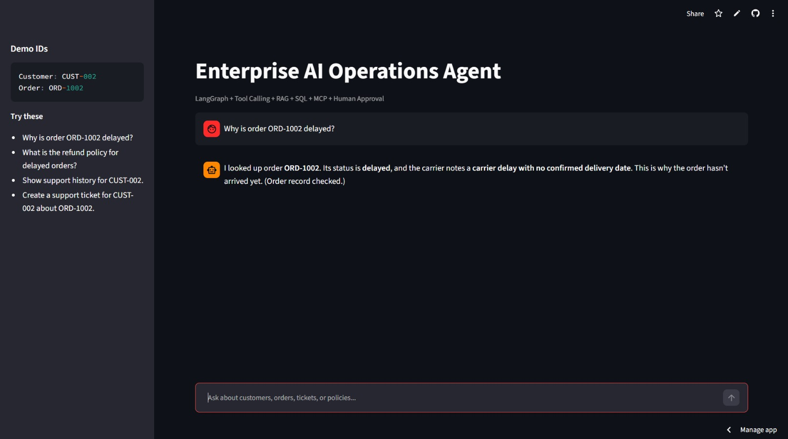

# Enterprise AI Operations Agent

An AI-powered enterprise operations assistant built using LangGraph, RAG, tool calling, MCP, and Streamlit.

## Live Demo

[Open the deployed app](https://ai-ops-agent.streamlit.app/)

## Demo



## What this project does

This project simulates an enterprise AI assistant that can:

- Look up customer information
- Check order status
- Retrieve previous support history
- Search company policies using RAG
- Decide which tool to call using LangGraph
- Create support tickets only after user approval
- Expose business operations through an MCP server

## Example Queries

- Why is order ORD-1002 delayed?
- What is the refund policy for delayed orders?
- Show support history for CUST-002.
- Create a support ticket for CUST-002 about ORD-1002.

## Tech Stack

- Python
- Streamlit
- LangGraph
- LangChain
- Groq API
- GPT-OSS
- RAG
- SQLite
- MCP
- Scikit-learn

## Project Structure

```text
enterprise_ai_ops/
├── .streamlit/
├── assets/
│   └── demo.jpeg
├── data/
│   └── policies.md
├── evals/
│   └── run_evals.py
├── scripts/
│   └── seed_db.py
├── src/
│   ├── config.py
│   ├── graph.py
│   ├── retriever.py
│   ├── services.py
│   └── tools.py
├── app.py
├── mcp_server.py
├── requirements.txt
└── README.md